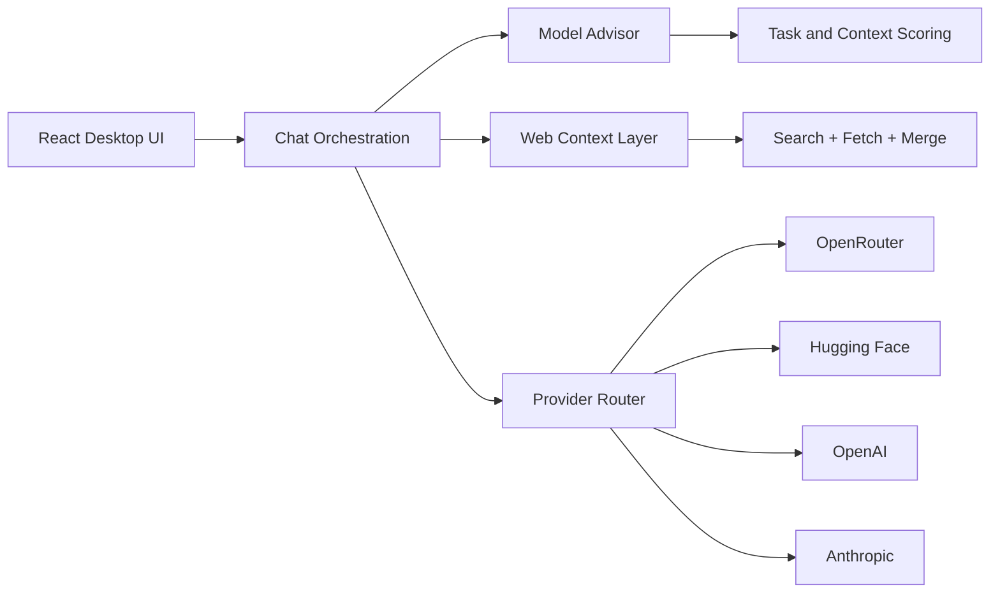

<div align="center">

# KritakaPrajna

### Desktop AI Assistant for serious builders

<a href="https://github.com/kaone31056789/KritakaPrajna/releases"></a>


<br>


</div>

---

## Why KritakaPrajna

KritakaPrajna gives you one place to chat, code, search the web, evaluate model cost/quality, and ship faster. It is designed like a practical desktop control center, not a toy chat window.

If you switch providers often, compare models by task, and want web-aware answers with visible source behavior, this app is built for that workflow.

## At a Glance

| Capability | What you get |
|---|---|
| Unified model access | OpenRouter, Hugging Face, OpenAI, Anthropic in one UI |
| Smart advisor | Task-aware + cost-aware + context-aware model picks |
| Web mode | Fast mode for speed, Deep mode for breadth |
| Builder UX | Markdown rendering, terminal command flow, retry/regenerate cycles |
| Desktop polish | Native window controls, updater support, installer delivery |

## Visual Tour

| Splash | Main Workspace |
|---|---|
|  |  |

## Feature Deep Dive

### 1) Multi-Provider Routing

Use one desktop app to access different ecosystems.

- OpenRouter for broad model catalog and flexible pricing
- Hugging Face for OSS and free-friendly workflows
- OpenAI / Anthropic for premium model quality

### 2) Smart Model Advisor

Advisor logic goes beyond static "best model" picks.

- Scores models by task fit, cost, speed, and availability
- Considers runtime context (web mode, reasoning depth, terminal intent)
- Suggests alternatives: value pick, free pick, better paid option

### 3) Web-Aware Answering

The app can fetch live web context before model generation.

- Fast mode: low-latency context fetch
- Deep mode: broader retrieval + stronger context for analysis
- Source-aware flow and explicit "no reliable sources" state when needed

### 4) Productive Coding Workflow

- Rich markdown + code highlighting
- Terminal-oriented command handling
- Regenerate/refine loops for iterative code quality
- File and upload-aware prompting

### 5) Desktop-First Packaging

- Electron desktop runtime
- NSIS installer packaging
- Release asset pipeline for updates

## Architecture Snapshot



## Install (Recommended)

1. Go to Releases: https://github.com/kaone31056789/KritakaPrajna/releases
2. Download: `KritakaPrajna-Setup-2.7.0.exe`
3. Install and launch the app
4. Add your API keys in Settings

## Build From Source

### Prerequisites

- Node.js 18+
- npm 9+
- Windows recommended for installer generation

### Setup

```bash
npm install
```

### Run Dev App

```bash
npm start
```

### Build Web Bundle

```bash
npm run build
```

### Build Windows Installer

```bash
npm run dist
```

## Configuration

Set provider credentials from the app Settings panel.

- OpenRouter API key
- Hugging Face token
- OpenAI API key
- Anthropic API key

Credentials are stored locally for desktop runtime.

## Tech Stack

- Electron
- React
- Tailwind CSS
- Framer Motion
- react-markdown + remark-gfm
- react-syntax-highlighter
- electron-builder

## Repository Layout

```text
electron/         Main process, IPC, preload bridge
src/components/   Interface and workflow components
src/api/          Provider adapters and model routing
src/utils/        Advisor, web, memory, intent, cost, helper logic
assets/           Build resources, icons, logos
Screenshots/      Documentation visuals
```

## Security and Reliability

- Local storage for API credentials in desktop context
- Context-isolated Electron bridge model
- Release-time dependency checks and packaging validation

## v2.7.0 Focus

- Better web behavior and clearer retrieval states
- Stronger advisor scoring with runtime signal awareness
- Workflow and UI refinements for daily use
- Updated installer and release metadata

## Contributing

PRs and issues are welcome.

When submitting changes, include:

- Clear summary of behavior change
- Reproduction steps (for bugs)
- Before/after notes
- Screenshots for UI updates

## Support

Use GitHub Issues for bugs, feature ideas, and release feedback.

---

<div align="center">

Built by Parikshit

</div>