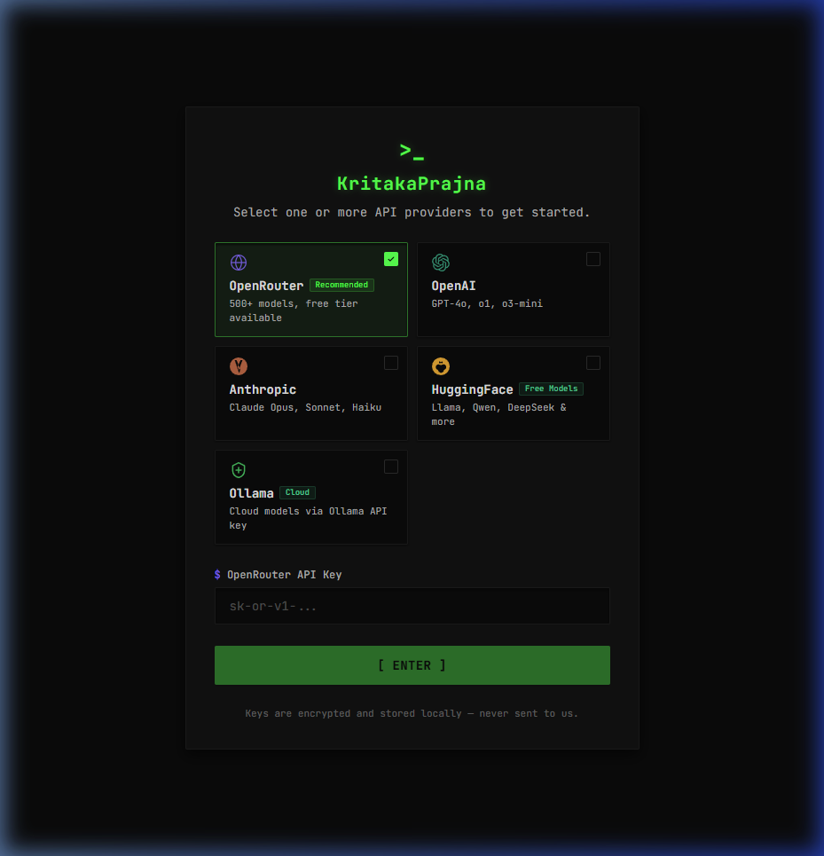
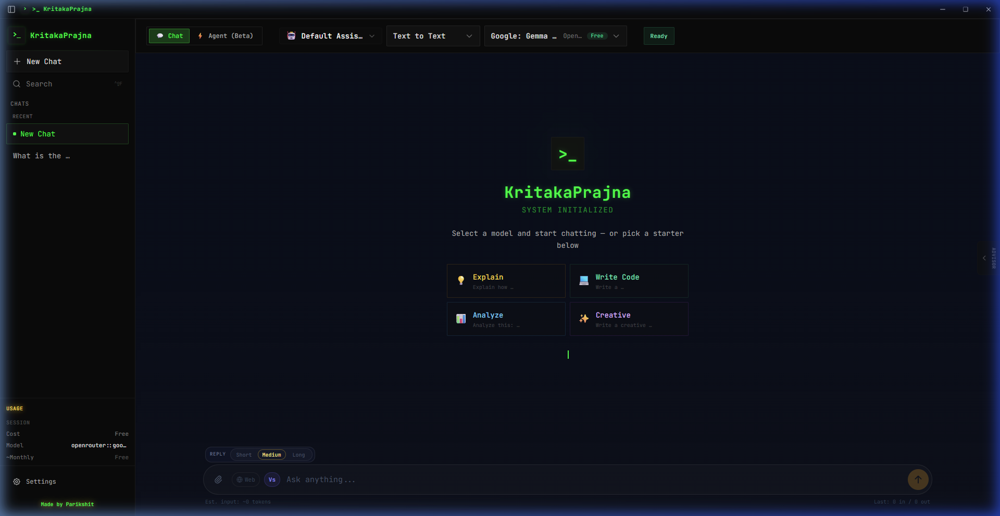
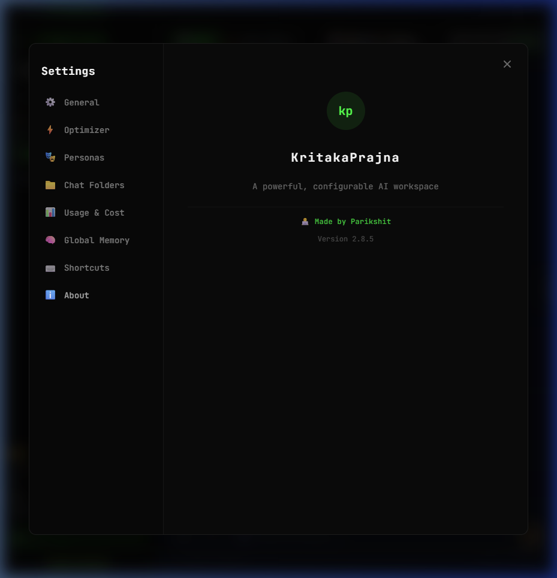
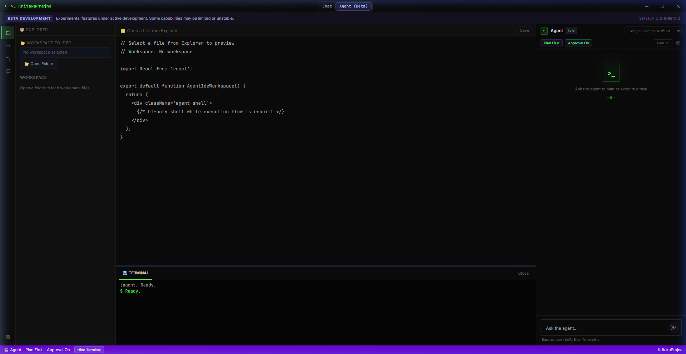
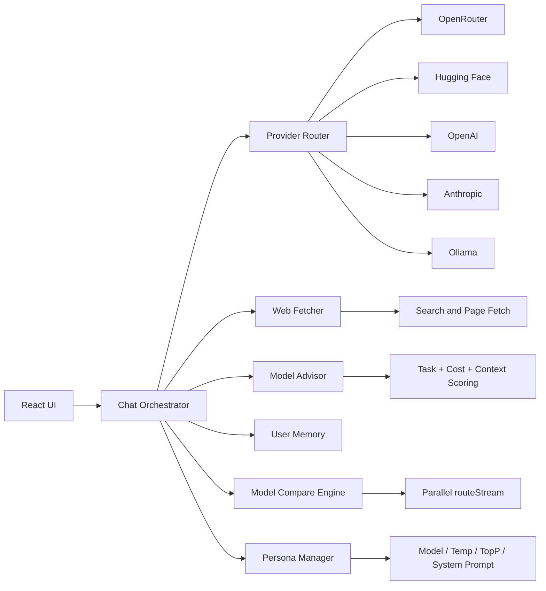

<div align="center">

# KritakaPrajna

### AI Desktop Workspace for Builders, Researchers, and Power Users

<a href="https://github.com/kaone31056789/KritakaPrajna/releases"></a>


<br>


</div>

---

## Table of Contents

1. [What Is KritakaPrajna](#what-is-kritakaprajna)
2. [Why It Is Different](#why-it-is-different)
3. [Visual Preview](#visual-preview)
4. [Feature Highlights](#feature-highlights)
5. [Architecture](#architecture)
6. [Provider and Task Coverage](#provider-and-task-coverage)
7. [Built-in Commands and Shortcuts](#built-in-commands-and-shortcuts)
8. [Install and Run](#install-and-run)
9. [Configuration](#configuration)
10. [Project Structure](#project-structure)
11. [Security and Privacy](#security-and-privacy)
12. [Troubleshooting](#troubleshooting)
13. [Release Notes (v3.0.0)](#release-notes-v300)
14. [Contributing](#contributing)
15. [Support](#support)

## What Is KritakaPrajna

KritakaPrajna is a desktop AI workspace that combines:

- multi-provider model access (OpenRouter, OpenAI, Anthropic, HuggingFace, Ollama),
- web-aware context retrieval (Fast + Deep modes),
- model quality/cost guidance via a built-in Smart Advisor,
- chat personas for custom AI behaviors,
- side-by-side model comparison,
- pinned chats, folders, and message bookmarks,
- **Agent mode (Beta)** for autonomous task execution and workspace management,
- and coding-friendly interaction patterns (terminal integration, markdown rendering, syntax highlighting)

in a single Electron application.

It is designed for users who want a practical daily driver for building software, researching topics, and comparing model outcomes without constantly switching tools.

## Why It Is Different

| Area | KritakaPrajna approach |
|---|---|
| Provider switching | One interface across OpenRouter, Hugging Face, OpenAI, Anthropic, Ollama |
| Model selection | Advisor scoring based on task + runtime context + cost |
| Model comparison | Inline side-by-side parallel streaming to evaluate two models on the same prompt |
| AI Personas | Custom AI profiles with per-persona model, temperature, top-p, and system prompt overrides |
| Web behavior | Fast and Deep retrieval modes, source injection, no-result handling |
| Coding workflow | Markdown rendering, syntax highlighting, terminal command integration |
| Organization | Pin chats, create color-coded folders, bookmark important messages |
| Desktop UX | macOS-style settings modal, native window controls, auto-updater, NSIS installer |

## Visual Preview

### API Onboarding

[](Screenshots/v2.8-api-key-screen.png)

### Main Chat Workspace

[](Screenshots/v2.8-main-chat.png)

### Settings Panel

[](Screenshots/v2.8-settings-panel.png)

### Agent Workspace (Beta)

[](Screenshots/v2.8-agent-beta.png)

## Feature Highlights

### Multi-Provider AI Routing

- **OpenRouter** for wide model catalog and pricing flexibility
- **Hugging Face** for open/free model options
- **OpenAI** and **Anthropic** for premium model workflows
- **Ollama Cloud** for hosted model access via API key

### Smart Model Advisor

The advisor uses scoring profiles that include:

- task type (coding, vision, document, general),
- estimated quality,
- cost per million tokens,
- availability signal,
- speed profile,
- feature context such as web mode, terminal intent, reasoning depth.

### Web Context Layer

The app can automatically fetch and inject live web data before response generation.

- **Fast mode**: lower-latency context retrieval
- **Deep mode**: broader retrieval for richer analysis
- Explicit source metadata attached to message state
- Clear fallback message when no reliable sources are found

### Chat Personas

Create and switch between custom AI profiles that override the global configuration on a per-chat or global basis.

- **Custom Profiles**: Name, avatar emoji, model override, system prompt, temperature, and top-p per persona
- **Built-in Defaults**: Ships with pre-configured personas (General Assistant, Code Expert, Research Analyst, Creative Writer)
- **Hot-Swap**: Instantly switch personas from the header dropdown in both Chat and Agent modes
- **Settings Editor**: Full persona CRUD management inside the Settings modal

### Quick Model Compare

Test two models head-to-head with a single prompt:

1. Click the **`Vs`** button in the input toolbar
2. Select **Model A** and **Model B** from your available models
3. Type your prompt and hit **Start Comparison**
4. Watch both models stream side-by-side in a split panel within your chat
5. Compare cost, token usage, and response quality
6. Click **"Keep This Response"** on the winner — it merges seamlessly into your conversation history

### Pinned Chats & Folders

Organize your conversation history with powerful sidebar tools:

- **📌 Pin Chats**: Sticky important conversations to the top of the sidebar
- **📁 Custom Folders**: Create named folders with custom hex color tags
- **Dynamic Grouping**: Sidebar auto-organizes into Pinned → Folders → Recent sections
- All organizational data persists across sessions via `localStorage`

### Message Bookmarks

Quickly save and navigate to important messages in long conversations:

- **🔖 Bookmark Toggle**: Click the amber bookmark icon on any user or assistant message
- **Floating Navigation**: A sticky pill bar appears at the top of the chat with numbered jump buttons
- **Smooth Auto-Scroll**: Click any bookmark pill to smoothly scroll directly to that message

### Terminal-Centric Interaction

Shell code blocks can be treated as executable command panels in desktop runtime.

- Ask mode (manual run)
- Auto-run mode (optional)
- Run/edit/kill workflow
- Command completion output can be fed back into assistant flow

### Agent Mode (Beta)

KritakaPrajna features a dedicated autonomous agent workspace designed for multi-step task completion and repository-scale development.

- **Self-Directed Planning**: The agent analyzes your objective, breaks it down into a multi-step plan, and executes each phase autonomously.
- **Terminal Integration**: Safe, approval-gated terminal access for running commands, tests, and builds.
- **Filesystem Awareness**: Context-aware file editing, creation, and deletion across your chosen workspace folder.
- **Tool-Calling Architecture**: Leveraging advanced model capabilities for precise tool usage and state management.
- **Beta Development**: Note that Agent mode is currently in Beta. We are actively refining the planning engine and safety guardrails.

### Token Optimization Pipeline

Intelligent token management for cost efficiency:

- **Adaptive Token Budgeting**: Model-aware budgets that respect per-model context limits
- **Sliding History Window**: Automatic overflow summarization for long conversations
- **Response Caching**: Session-level cache for repeated prompts (with per-chat isolation)
- **Deep Analysis Mode**: Expanded context window for complex queries with visual progress tracking

### Memory and Preferences

User memory supports three categories:

- Preferences
- Coding Style
- Context Memory

with optional auto-detection from conversation patterns and JSON export capability.

## Architecture



## Provider and Task Coverage

| Task / Capability | Notes |
|---|---|
| Text generation | Primary default mode |
| Image-to-text | Vision-capable model path |
| Text-to-image | Supported through routed model capability checks |
| Image-to-image | Capability-gated model filtering |
| Text-to-video | Capability-gated model filtering |
| Text-to-speech | Capability-gated model filtering |
| Model comparison | Dual parallel streaming with inline UI |

Actual model availability depends on active provider keys and provider-side model status.

## Built-in Commands and Shortcuts

### Slash Commands

| Command | Purpose |
|---|---|
| `/explain <file>` | Explain a file in detail |
| `/fix <file>` | Review and fix issues in a file |
| `/summarize <file>` | Summarize file role/API/dependencies |
| `/test-terminal` | Terminal feature test prompt |
| `/test-web` | Web feature test prompt |
| `/test-features` | Combined web + terminal test prompt |

### Default Shortcuts

| Action | Shortcut |
|---|---|
| Send Message | `Ctrl+Enter` |
| New Chat | `Ctrl+N` |
| Open Settings | `Ctrl+,` |
| Retry Response | `Ctrl+R` |
| Toggle Sidebar | `Ctrl+B` |
| Open Model Selector | `Ctrl+K` |

### Reasoning Modes

- **Fast** — lightweight, low-latency responses
- **Balanced** — default mode balancing depth and speed
- **Deep** — expanded reasoning with chain-of-thought analysis

## Install and Run

### Option A: Installer (Recommended)

1. Open Releases: https://github.com/kaone31056789/KritakaPrajna/releases
2. Download `KritakaPrajna-Setup-3.0.0.exe`
3. Install and launch
4. Add your API keys in Settings

### Option B: Run from Source

#### Prerequisites

- Node.js 18+
- npm 9+
- Windows recommended for installer build path

#### Install dependencies

```bash
npm install
```

#### Start development app

```bash
npm start
```

#### Build production bundle

```bash
npm run build
```

#### Build Windows installer

```bash
npm run dist
```

## Configuration

### API Providers

Configure inside Settings (accessible via `Ctrl+,`):

- OpenRouter key
- OpenAI key
- Anthropic key
- Hugging Face key
- Ollama Cloud API key (from `ollama.com/settings/keys`)

### How to Obtain API Keys

#### OpenRouter

1. Go to https://openrouter.ai/
2. Sign in and open the keys page: https://openrouter.ai/keys
3. Create a new key and copy the `sk-or-v1-...` token
4. Paste it into the OpenRouter provider field in app settings

#### OpenAI

1. Go to https://platform.openai.com/
2. Open API keys: https://platform.openai.com/api-keys
3. Create a new secret key and copy it immediately
4. Paste it into the OpenAI provider field in app settings

#### Anthropic

1. Go to https://console.anthropic.com/
2. Open API Keys: https://console.anthropic.com/settings/keys
3. Create a key and copy the `sk-ant-...` value
4. Paste it into the Anthropic provider field in app settings

#### Hugging Face

1. Go to https://huggingface.co/
2. Open Access Tokens: https://huggingface.co/settings/tokens
3. Create a token suitable for Inference API usage
4. Paste the `hf_...` token into the Hugging Face provider field in app settings

#### Ollama Cloud

1. Go to https://ollama.com/
2. Open Keys: https://ollama.com/settings/keys
3. Create a cloud API key
4. Paste that key into the Ollama provider field in app settings

### Local Settings

The app stores local runtime preferences such as:

- selected model and task preferences,
- keyboard shortcuts,
- user memory entries,
- chat personas and folder configurations,
- pinned chats and bookmark states,
- command panel mode,
- chat/session state.

## Project Structure

```text
electron/             Main process, IPC handlers, preload bridge
public/               Static app shell
src/
  api/                Provider adapters and routing logic
  components/
    ChatApp.jsx       Main orchestrator (chat state, send logic, compare engine)
    MessageList.jsx   Message rendering, bookmarks, comparison panels
    MessageInput.jsx  Input field, control bar, Vs trigger
    SettingsPanel.jsx macOS-style settings modal (tabbed navigation)
    CompareModal.jsx  Model comparison launcher UI
    PersonaEditor.jsx Persona CRUD management
    PersonaSelector   Header persona dropdown
    FolderEditor.jsx  Folder management with color tagging
    ModelSelector     Provider-aware model selection
    SmartModelBanner  Auto-suggestion banners
    ModelAdvisorCard  Cost/quality advisor panel
    AgentIdeWorkspace Agent mode workspace
    TitleBar.jsx      Custom title bar with traffic-light controls
    KPLogo.jsx        Branding component
  utils/
    smartModelSelect  Task detection, model filtering, advisor scoring
    costTracker       Cost calculation, session tracking
    tokenOptimizer    Adaptive budgeting, sliding window, overflow summarization
    commandParser     Slash command parsing and hints
    rateLimiter       Model health tracking, fallback routing
    modelAdvisor      Advisor data generation
    keyboardShortcuts Shortcut normalization
    webFetch          Web search and page extraction
assets/               Icons and packaging resources
Screenshots/          Documentation images
build/                Production web output (generated)
dist/                 Installer output (generated)
```

## Security and Privacy

- API credentials are managed locally in desktop context.
- Electron uses context isolation and preload bridge exposure.
- Command execution path includes safety checks for blocked dangerous patterns.
- Release pipeline uses dependency audit checks and packaging verification.
- No telemetry or analytics — all data stays on your machine.

## Troubleshooting

### App starts but models are missing

- Verify provider keys in Settings.
- Check network/API status for selected providers.

### Web mode appears to return no sources

- Try Deep mode for broader retrieval.
- Rephrase with more explicit search terms.
- Check whether query needs current-event/news signals.

### Model Compare shows errors

- Ensure both selected models are available with your current API keys.
- Some models may have rate limits — try again after a brief wait.

### Installer build fails

- Remove stale generated artifacts from `build/` and `dist/`.
- Re-run `npm install` and then `npm run dist`.

## Release Notes (v3.0.0)

### Productivity Suite (New)

- **Chat Personas**: Create custom AI profiles with per-persona model, temperature, top-p, and system prompt overrides. Hot-swap from the header dropdown.
- **Quick Model Compare**: Side-by-side parallel streaming of two models against the same prompt. Inline comparison panels with cost tracking and "Keep This Response" resolution.
- **Pinned Chats & Folders**: Pin important conversations, create color-coded folders, and auto-grouped sidebar (Pinned → Folders → Recent).
- **Message Bookmarks**: Bookmark messages with floating navigation pills and smooth auto-scroll anchoring.
- **Compact Input UI**: Reasoning, web mode, and reply controls integrated inline within the text input border for maximum vertical space efficiency.
- **macOS-Style Settings**: Full-screen overlay modal with tabbed navigation, ESC handling, and organized configuration categories.

### Agent Workspace (Beta)

- **Agent Mode Integration**: Added a high-performance IDE-like workspace for autonomous agent tasks.
- **Planning Loop**: Implemented a real-time planning loop with visual progress indicators and step-by-step status updates.
- **Workspace Isolation**: Support for safe workspace folder picking to isolate agent operations.
- **Approval Workflow**: Integrated terminal command and file edit approval system for user-in-the-loop safety.
- **Beta Marking**: Tagged all agent features as "Beta" to reflect active experimental status.

### Core Improvements

- Version update and new Windows installer target: `KritakaPrajna-Setup-3.0.0.exe`
- Fixed response cache scope issues:
  - Cache keys are now chat-specific to prevent cross-chat response leakage
  - Regenerate/retry paths now bypass cache for fresh responses
- Upgraded token optimization pipeline:
  - Moved from hard trim behavior to adaptive, model-aware token budgeting
  - Improved semantic condensation and overflow summarization for long prompts/history
- Added deep-analysis context visibility improvements:
  - Context window visualizer now tracks composer token usage more clearly
  - Deep-analysis visibility logic improved so relevant UI appears when expected
- Improved professional UX for windowed mode:
  - Compact responsive control layout for Reasoning/Web/Reply controls
  - Cleaner alignment and reduced vertical spacing in the composer
  - Compact context panel styling for non-fullscreen workflows
- Fixed Ollama Cloud usage display behavior:
  - Stricter parsing for cloud usage values
  - Prevents misleading zero/empty usage states in UI
- Added Memory export workflow in Settings:
  - New Export action for user memory as JSON
  - Native Electron save dialog support for export destination

## Contributing

Issues and pull requests are welcome.

When contributing, include:

- clear summary of the change,
- reproduction steps for fixes,
- impact notes (before/after),
- screenshots for UI changes where relevant.

## Support

For help, bugs, feature requests, and release feedback, use GitHub Issues.

---

<div align="center">

Built with ❤️ by **Parikshit**

</div>