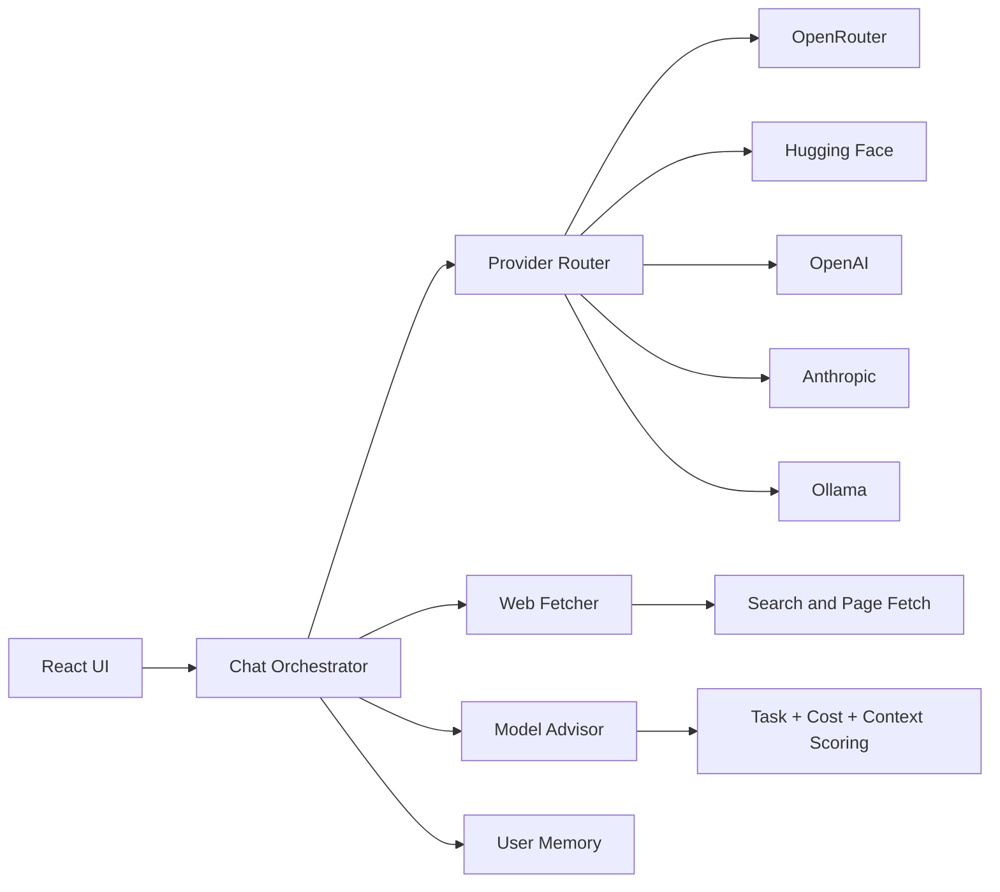

<div align="center">

# KritakaPrajna

### AI Desktop Workspace for Builders, Researchers, and Power Users

<a href="https://github.com/kaone31056789/KritakaPrajna/releases"></a>


<br>


</div>

---

## Table of Contents

1. [What Is KritakaPrajna](#what-is-kritakaprajna)
2. [Why It Is Different](#why-it-is-different)
3. [Visual Preview](#visual-preview)
4. [Capability Overview](#capability-overview)
5. [Architecture](#architecture)
6. [Provider and Task Coverage](#provider-and-task-coverage)
7. [Built-in Commands and Shortcuts](#built-in-commands-and-shortcuts)
8. [Install and Run](#install-and-run)
9. [Configuration](#configuration)
10. [Project Structure](#project-structure)
11. [Security and Privacy](#security-and-privacy)
12. [Troubleshooting](#troubleshooting)
13. [Release Notes (v2.8.5)](#release-notes-v285)
14. [Contributing](#contributing)
15. [Support](#support)

## What Is KritakaPrajna

KritakaPrajna is a desktop AI workspace that combines:

- multi-provider model access,
- web-aware context retrieval,
- model quality/cost guidance,
- and coding-friendly interaction patterns

in a single Electron application.

It is designed for users who want a practical daily driver for building software, researching topics, and comparing model outcomes without constantly switching tools.

## Why It Is Different

| Area | KritakaPrajna approach |
|---|---|
| Provider switching | One interface across OpenRouter, Hugging Face, OpenAI, Anthropic, Ollama |
| Model selection | Advisor scoring based on task + runtime context + cost |
| Web behavior | Fast and Deep retrieval modes, source injection, no-result handling |
| Coding workflow | Markdown rendering, syntax highlighting, terminal command integration |
| Desktop UX | Native window controls, updater flow, installer packaging |

## Visual Preview

### API Onboarding

[](Screenshots/v2.8-api-key-screen.png)

### Main Chat Workspace

[](Screenshots/v2.8-main-chat.png)

### Settings Panel

[](Screenshots/v2.8-settings-panel.png)

## Capability Overview

### Multi-Provider AI Routing

- OpenRouter for wide model catalog and pricing flexibility
- Hugging Face for open/free model options
- OpenAI and Anthropic for premium model workflows
- Ollama Cloud for hosted model access via API key

### Smart Model Advisor

The advisor uses scoring profiles that include:

- task type (coding, vision, document, general),
- estimated quality,
- cost per million tokens,
- availability signal,
- speed profile,
- feature context such as web mode, terminal intent, reasoning depth.

### Web Context Layer

The app can automatically fetch and inject live web data before response generation.

- Fast mode: lower-latency context retrieval
- Deep mode: broader retrieval for richer analysis
- explicit source metadata attached to message state
- clear fallback message when no reliable sources are found

### Terminal-Centric Interaction

Shell code blocks can be treated as executable command panels in desktop runtime.

- Ask mode (manual run)
- Auto-run mode (optional)
- run/edit/kill workflow
- command completion output can be fed back into assistant flow

### Memory and Preferences

User memory supports three categories:

- Preferences
- Coding Style
- Context Memory

with optional auto-detection from conversation patterns.

## Architecture



## Provider and Task Coverage

| Task / Capability | Notes |
|---|---|
| Text generation | Primary default mode |
| Image-to-text | Vision-capable model path |
| Text-to-image | Supported through routed model capability checks |
| Image-to-image | Capability-gated model filtering |
| Text-to-video | Capability-gated model filtering |
| Text-to-speech | Capability-gated model filtering |

Actual model availability depends on active provider keys and provider-side model status.

## Built-in Commands and Shortcuts

### Slash Commands

| Command | Purpose |
|---|---|
| `/explain <file>` | Explain a file in detail |
| `/fix <file>` | Review and fix issues in a file |
| `/summarize <file>` | Summarize file role/API/dependencies |
| `/test-terminal` | Terminal feature test prompt |
| `/test-web` | Web feature test prompt |
| `/test-features` | Combined web + terminal test prompt |

### Default Shortcuts

| Action | Shortcut |
|---|---|
| Send Message | `Ctrl+Enter` |
| New Chat | `Ctrl+N` |
| Open Settings | `Ctrl+,` |
| Retry Response | `Ctrl+R` |
| Toggle Sidebar | `Ctrl+B` |
| Open Model Selector | `Ctrl+K` |

### Reasoning Modes

- Fast
- Balanced
- Deep

## Install and Run

### Option A: Installer (Recommended)

1. Open Releases: https://github.com/kaone31056789/KritakaPrajna/releases
2. Download `KritakaPrajna-Setup-2.8.5.exe`
3. Install and launch
4. Add your API keys in Settings

### Option B: Run from Source

#### Prerequisites

- Node.js 18+
- npm 9+
- Windows recommended for installer build path

#### Install dependencies

```bash
npm install
```

#### Start development app

```bash
npm start
```

#### Build production bundle

```bash
npm run build
```

#### Build Windows installer

```bash
npm run dist
```

## Configuration

### API Providers

Configure inside Settings:

- OpenRouter key
- OpenAI key
- Anthropic key
- Hugging Face key
- Ollama Cloud API key (from `ollama.com/settings/keys`)

### How to Obtain API Keys

#### OpenRouter

1. Go to https://openrouter.ai/
2. Sign in and open the keys page: https://openrouter.ai/keys
3. Create a new key and copy the `sk-or-v1-...` token
4. Paste it into the OpenRouter provider field in app settings

#### OpenAI

1. Go to https://platform.openai.com/
2. Open API keys: https://platform.openai.com/api-keys
3. Create a new secret key and copy it immediately
4. Paste it into the OpenAI provider field in app settings

#### Anthropic

1. Go to https://console.anthropic.com/
2. Open API Keys: https://console.anthropic.com/settings/keys
3. Create a key and copy the `sk-ant-...` value
4. Paste it into the Anthropic provider field in app settings

#### Hugging Face

1. Go to https://huggingface.co/
2. Open Access Tokens: https://huggingface.co/settings/tokens
3. Create a token suitable for Inference API usage
4. Paste the `hf_...` token into the Hugging Face provider field in app settings

#### Ollama Cloud

1. Go to https://ollama.com/
2. Open Keys: https://ollama.com/settings/keys
3. Create a cloud API key
4. Paste that key into the Ollama provider field in app settings

### Local Settings

The app stores local runtime preferences such as:

- selected model and task preferences,
- keyboard shortcuts,
- user memory entries,
- command panel mode,
- chat/session state.

## Project Structure

```text
electron/           Main process, IPC handlers, preload bridge
public/             Static app shell
src/
  api/              Provider adapters and routing logic
  components/       UI, chat, settings, advisor, renderers
  utils/            Advisor ranking, intents, memory, cost, parsing helpers
assets/             Icons and packaging resources
Screenshots/        Documentation images
build/              Production web output (generated)
dist/               Installer output (generated)
```

## Security and Privacy

- API credentials are managed locally in desktop context.
- Electron uses context isolation and preload bridge exposure.
- Command execution path includes safety checks for blocked dangerous patterns.
- Release pipeline uses dependency audit checks and packaging verification.

## Troubleshooting

### App starts but models are missing

- Verify provider keys in Settings.
- Check network/API status for selected providers.

### Web mode appears to return no sources

- Try Deep mode for broader retrieval.
- Rephrase with more explicit search terms.
- Check whether query needs current-event/news signals.

### Installer build fails

- Remove stale generated artifacts from `build/` and `dist/`.
- Re-run `npm install` and then `npm run dist`.

## Release Notes (v2.8.5)

- Version update and new Windows installer target: `KritakaPrajna-Setup-2.8.5.exe`
- Fixed response cache scope issues:
  - cache keys are now chat-specific to prevent cross-chat response leakage
  - regenerate/retry paths now bypass cache for fresh responses
- Upgraded token optimization pipeline:
  - moved from hard trim behavior to adaptive, model-aware token budgeting
  - improved semantic condensation and overflow summarization for long prompts/history
- Added deep-analysis context visibility improvements:
  - context window visualizer now tracks composer token usage more clearly
  - deep-analysis visibility logic improved so relevant UI appears when expected
- Improved professional UX for windowed mode:
  - compact responsive control layout for Reasoning/Web/Reply controls
  - cleaner alignment and reduced vertical spacing in the composer
  - compact context panel styling for non-fullscreen workflows
- Fixed Ollama Cloud usage display behavior:
  - stricter parsing for cloud usage values
  - prevents misleading zero/empty usage states in UI
- Added Memory export workflow in Settings:
  - new Export action for user memory as JSON
  - native Electron save dialog support for export destination

## Contributing

Issues and pull requests are welcome.

When contributing, include:

- clear summary of the change,
- reproduction steps for fixes,
- impact notes (before/after),
- screenshots for UI changes where relevant.

## Support

For help, bugs, feature requests, and release feedback, use GitHub Issues.

---

<div align="center">

Built by Parikshit

</div>